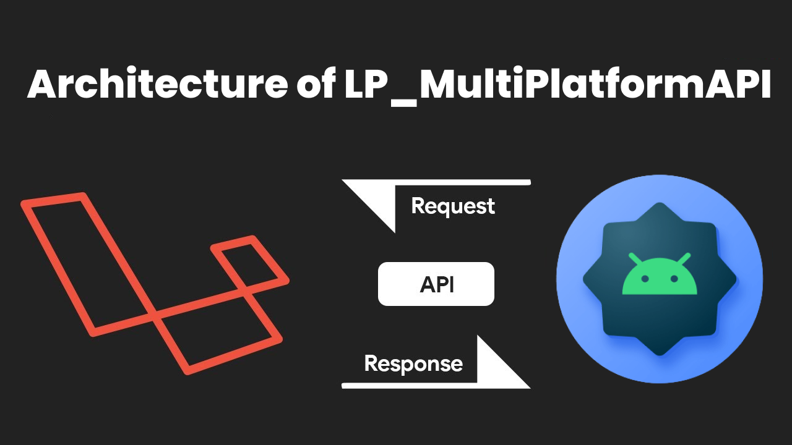

# LP_MultiPlatformAPI

## Description

LP_MultiPlatformAPI is a Laravel API designed to support data sharing between a JavaFX desktop application and an Android mobile application. The API is built with Laravel, a powerful and popular PHP web application framework, which provides a flexible and scalable platform for building web services. The API is designed to enable data sharing between different platforms, which can be useful in various scenarios, such as data synchronization between desktop and mobile apps.

## Requirements

The LP_MultiPlatformAPI requires the following:

- PHP version >8.2
- Laravel version 8 or higher

## Installation

To use the LP_MultiPlatformAPI, you need to have PHP and Laravel installed on your system. If you don't have them installed, follow these steps:

1. Install PHP version >8.2 on your system.
2. Install Composer, a dependency manager for PHP.
3. Install Laravel using Composer.

Once you have installed Laravel, you can clone the repository and run it on your local machine by following these steps:

1. Clone the repository to your local machine.
2. Install the required dependencies using Composer.
3. Configure the database connection in the `.env` file.
4. Run the migrations to create the necessary tables in the database.

You can then start the server and begin using the API.

## Usage

The LP_MultiPlatformAPI provides a RESTful API that can be accessed by the JavaFX desktop application and the Android mobile application. The API supports CRUD (create, read, update, delete) operations on the data. You can use the API to create new records, retrieve existing records, update records, and delete records.

To use the API, you need to send HTTP requests to the API endpoints. The API endpoints are documented in the `routes/api.php` file. You can use a tool like Postman to test the API endpoints and send requests.

## Contributing

We welcome contributions to the LP_MultiPlatformAPI. If you would like to contribute, please follow these steps:

1. Fork the repository.
2. Create a new branch for your changes.
3. Make your changes and commit them.
4. Push the changes to your fork.
5. Submit a pull request.

